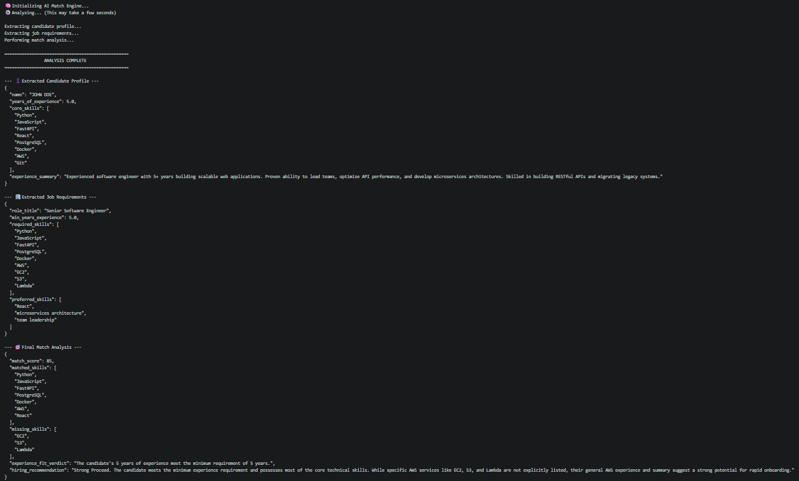

# AI Candidate-Job Match Analyzer

A Simple Python application built with LangChain that compares a candidate's resume against a job description. The tool extracts key information from PDF documents into structured data formats and performs an objective comparative analysis to evaluate candidate fit.

## Features

PDF Ingestion: Parses raw text from resume and job description PDFs using PyMuPDF.

Structured Information Extraction: Uses LangChain and Pydantic to extract specific data fields (skills, experience, summary) from raw text into clean JSON schemas.

Targeted Match Analysis: Compares the structured candidate profile directly against the job requirements to generate a compatibility score, list matching/missing skills, and provide a hiring recommendation.

## Tech Stack

Framework: LangChain (LCEL)

Data Validation: Pydantic

PDF Parsing: PyMuPDF (fitz)

Environment Management: python-dotenv

Package Manager: uv (or standard pip)

## How To Run

Place your sample PDFs inside the project directory (e.g., in a data/ folder) and execute the script via the command line using the module flag (-m):

`python -m src.main --resume data/my_resume.pdf --jd data/job_description.pdf`

## Project Screenshot 

